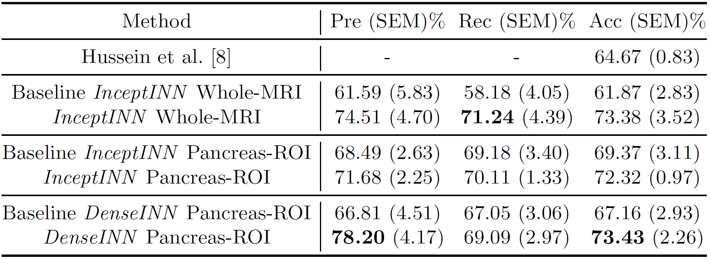

# INN-Inflated-Neural-Nets
### by [Rodney LaLonde](https://rodneylalonde.wixsite.com/personal), [Irene Tanner](https://www.linkedin.com/in/irene-l-tanner/), [Katerina Nikiforaki](https://scholar.google.com/citations?user=Cfq6SIEAAAAJ&hl=en), [Georgios Z. Papadakis](https://scholar.google.com/citations?user=Hes5vroAAAAJ&hl=en), [Pujan Kandel](https://scholar.google.com/citations?user=SRFTA9gAAAAJ&hl=en), [Candice W. Bolan](https://www.mayoclinic.org/biographies/bolan-candice-w-m-d/bio-20055590), [Michael B. Wallace](https://www.mayo.edu/research/faculty/wallace-michael-b-m-d/bio-00092410), and [Ulas Bagci](http://www.cs.ucf.edu/~bagci/)

### The official code for the MICCAI 2019 paper "INN: Inflated Neural Networks for IPMN Diagnosis"

The original paper can be found at [MICCAI 2019](https://link.springer.com/chapter/10.1007/978-3-030-32254-0_12) or [arXiv](https://arxiv.org/abs/1907.00437).

A project page for this work can be found at [my research blog](https://rodneylalonde.wixsite.com/personal/post/inn-inflated-neural-networks-for-ipmn-diagnosis).


## Abstract
Intraductal papillary mucinous neoplasm (IPMN) is a precursor to pancreatic ductal adenocarcinoma. While over half of patients are diagnosed with pancreatic cancer at a distant stage, patients who are diagnosed early enjoy a much higher 5-year survival rate of 34% compared to 3% in the former; hence, early diagnosis is key. Unique challenges in the medical imaging domain such as extremely limited annotated data sets and typically large 3D volumetric data have made it difficult for deep learning to secure a strong foothold. In this work, we construct two novel "inflated" deep network architectures, InceptINN and DenseINN, for the task of diagnosing IPMN from multisequence (T1 and T2) MRI. These networks inflate their 2D layers to 3D and bootstrap weights from their 2D counterparts (Inceptionv3 and DenseNet121 respectively) trained on ImageNet to the new 3D kernels. We also extend the inflation process by further expanding the pre-trained kernels to handle any number of input modalities and different fusion strategies. This is one of the first studies to train an end-to-end deep network on multisequence MRI for IPMN diagnosis, and shows that our proposed novel inflated network architectures are able to handle the extremely limited training data (139 MRI scans), while providing an absolute improvement of 8.76% in accuracy for diagnosing IPMN over the current state-of-the-art.

## Multisequence MRI scans


## Multisequence MRI scans with Pancreas ROI Extracted


## INN Framework Overview


## Quantative Results on the IPMN Diagnosis Dataset




## Getting Started Guide

### Install Required Packages
This repo of code is written for Keras using the TensorFlow backend. Please install all required packages before using this code.
```bash
pip install -r requirements.txt
```

### Dataset Structure

Inside the data root folder (*i.e.* where you have your data stored) you should have two folders: one called *cropped_scans* and one called *whole_scans*. All models, results, etc. are saved to one of these two directories depending on the experiments you run. Within each of these, you should have two folders: one called *imgs* and one called *masks*. 

```bash
<your_root_dir>
|--Cropped_Scans
|  |--<modality_1>
|  |  |--CAD-## <## is patient number>
|  |  |  |--<img_name.hdr or .nii or .nii.gz or .mhd>
|  |--<modality_2>
|  |  |--CAD-## <## is patient number>
|  |  |  |--<img_name.hdr or .nii or .nii.gz or .mhd>
|  |--...
|  |--<modality_n>
|  |  |--CAD-## <## is patient number>
|  |  |  |--<img_name.hdr or .nii or .nii.gz or .mhd>
|  |--<modality>_Masks <These are masks for all modalities (i.e. register modalities)>
|  |  |--CAD-## <## is patient number>
|  |  |  |--<img_name.hdr or .nii or .nii.gz or .mhd>
|--Whole_Scans
|  |--<modality_1>
|  |  |--CAD-## <## is patient number>
|  |  |  |--<img_name.hdr or .nii or .nii.gz or .mhd>
|  |--<modality_2>
|  |  |--CAD-## <## is patient number>
|  |  |  |--<img_name.hdr or .nii or .nii.gz or .mhd>
|  |--...
|  |--<modality_n>
|  |  |--CAD-## <## is patient number>
|  |  |  |--<img_name.hdr or .nii or .nii.gz or .mhd>
|  |--<modality>_Masks <These are masks for all modalities (i.e. register modalities)>
|  |  |--CAD-## <## is patient number>
|  |  |  |--<img_name.hdr or .nii or .nii.gz or .mhd>
```

Note inside load_3D_data there are a few spots where it is hardcoded for T1 and T2 MRI. You might need to make a few small coding changes to make this able to handle any number of modalities.


### Main File

From the main file (main.py) you can train, test, and predict using the INN framework. Simply set the ```--train```, ```--test```, or ```--pred``` flags to 0 or 1 to turn these off or on respectively. The arguments ```--data_root_dir``` and ```--modality_dir_list``` are the only required arguments. Data root directory should be set to the directory containing your *Cropped_Scans* and *Whole_Scan* folders (Note you can call these whatever you want and only have one of them if you choose). The Modality Directory List is where you specify the names of the folders which contain the images of the different modalities (see the data structure section above). There are many more arguments that can be set and these are all explained in the main.py file. 

### Citation

If you use significant portions of our code or ideas from our paper in your research, please cite our work:
```
@InProceedings{10.1007/978-3-030-32254-0_12,
author="LaLonde, Rodney
and Tanner, Irene
and Nikiforaki, Katerina
and Papadakis, Georgios Z.
and Kandel, Pujan
and Bolan, Candice W.
and Wallace, Michael B.
and Bagci, Ulas",
editor="Shen, Dinggang
and Liu, Tianming
and Peters, Terry M.
and Staib, Lawrence H.
and Essert, Caroline
and Zhou, Sean
and Yap, Pew-Thian
and Khan, Ali",
title="INN: Inflated Neural Networks for IPMN Diagnosis",
booktitle="Medical Image Computing and Computer Assisted Intervention -- MICCAI 2019",
year="2019",
publisher="Springer International Publishing",
address="Cham",
pages="101--109",
abstract="Intraductal papillary mucinous neoplasm (IPMN) is a precursor to pancreatic ductal adenocarcinoma. While over half of patients are diagnosed with pancreatic cancer at a distant stage, patients who are diagnosed early enjoy a much higher 5-year survival rate of 34{\%} compared to 3{\%} in the former; hence, early diagnosis is key. Unique challenges in the medical imaging domain such as extremely limited annotated data sets and typically large 3D volumetric data have made it difficult for deep learning to secure a strong foothold. In this work, we construct two novel ``inflated'' deep network architectures, InceptINN and DenseINN, for the task of diagnosing IPMN from multisequence (T1 and T2) MRI. These networks inflate their 2D layers to 3D and bootstrap weights from their 2D counterparts (Inceptionv3 and DenseNet121 respectively) trained on ImageNet to the new 3D kernels. We also extend the inflation process by further expanding the pre-trained kernels to handle any number of input modalities and different fusion strategies. This is one of the first studies to train an end-to-end deep network on multisequence MRI for IPMN diagnosis, and shows that our proposed novel inflated network architectures are able to handle the extremely limited training data (139 MRI scans), while providing an absolute improvement of {\$}{\$}{\backslash}varvec{\{}8.76{\}}{\$}{\$}{\%} in accuracy for diagnosing IPMN over the current state-of-the-art. Code is publicly available at https://github.com/lalonderodney/INN-Inflated-Neural-Nets.",
isbn="978-3-030-32254-0"
}
```

### Questions or Comments

Please direct any questions or comments to me; I am happy to help in any way I can. You can either comment on the [project page](https://rodneylalonde.wixsite.com/personal/research-blog/capsules-for-object-segmentation), or email me directly at lalonde@knights.ucf.edu.

